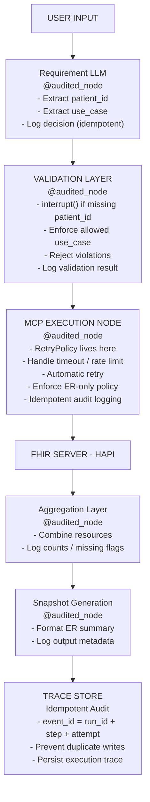

# ER Snapshot Agent: Architecture Overview

This repository implements a LangGraph-based ER Snapshot Agent that retrieves FHIR data via MCP, applies deterministic governance rules, and generates an LLM-formatted ER clinical summary with audit logging.

# Workflow

## High-Level Workflow
```text
User Input
   ↓
Requirement LLM
   ↓
Validation Layer
   ↓
MCP Execution
   ↓
Aggregation Layer
   ↓
Snapshot Generator
   ↓
Trace Store (Idempotent Audit)
```
## Detailed Workflow

# Layer Responsibilities

This section describes the responsibility of each layer in the ER Snapshot Agent workflow.

## Requirement LLM  
`nodes/requirement_llm.py`

**Purpose:**  
Extract structured intent from user input.

### Responsibilities
- Extract `patient_id`
- Extract `use_case`
- Log decision (via audit layer)

### Does NOT
- Enforce policy
- Call MCP
- Perform governance checks

**Type:** LLM node


## Validation Layer  
`nodes/validation_layer.py`

**Purpose:**  
Deterministic governance enforcement before any tool access.

### Responsibilities
- Reject missing `patient_id`
- Enforce allowed `use_case`
- Enforce ER-only policy
- Enforce read-only restriction
- Sanitize tool parameters
- May raise `interrupt()` or `ValidationError`

### Design Notes
- No LLM
- No MCP
- Fully deterministic
- Governance errors are final (not retried)

**Type:** Deterministic node

## MCP Execution  
`nodes/mcp_executor.py`

**Purpose:**  
Safe interface to the FHIR server via MCP.

### Responsibilities
- Call MCP tools
- Handle timeout / rate limits
- Apply LangGraph `RetryPolicy`
- Log attempt number
- Ensure idempotent audit logging

### Retry Behavior
- Configured at the graph level
- Retries only transient errors
- Does NOT retry governance failures

**Type:** Tool execution node (with retry control)

## Aggregation Layer  
`nodes/aggregation.py`

**Purpose:**  
Combine FHIR resources into a structured clinical bundle.

### Combines
- Patient
- ER encounters
- Medications
- Allergies

### Responsibilities
- Structure clinical data
- Log missing-resource flags
- Prepare data for summary generation

**Type:** Deterministic transformation

## Snapshot Generator  
`nodes/snapshot_generator.py`

**Purpose:**  
Format structured clinical data into an ER summary.

### Responsibilities
- LLM-based formatting
- Generate ER clinical snapshot
- Log output metadata

### Does NOT
- Access FHIR directly
- Enforce policy
- Perform validation

**Type:** LLM formatting node

## Idempotent Audit  
`audit/`

**Purpose:**  
Ensure retry-safe observability and sponsor-grade traceability.

### Event Design
- `event_id = run_id + step + attempt`
- Prevent duplicate writes
- Persist full execution trace

### Guarantees
- Accurate trace history
- Retry-safe logging
- Transparent system behavior

This layer ensures production-level observability across the workflow.
