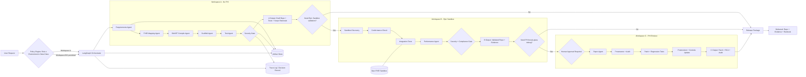

# Original Architecture Blueprint (Sponsor)

```mermaid
flowchart LR

  U[User Request] --> P{Policy Engine: Role x Environment x Data Class}
  P -->|Workspace A| LG[LangGraph Orchestrator]
  P -->|Workspace B/C permitted| LG

  LG --> S[(Artifact Store)]
  LG --> T[(Trace Log / Decision Record)]

  subgraph A[Workspace A - No PHI]
    A1[Requirements Agent] --> A2[FHIR Mapping Agent]
    A2 --> A3[SMART Compile Agent]
    A3 --> A4[Scaffold Agent]
    A4 --> A5[Test Agent]
    A5 --> A6{Security Gate}
    A6 --> Aout[A Output: Draft Repo + Tests + Scope Rationale]
    Aout --> Aesc{Need Epic Sandbox validation?}
  end

  LG --> A1
  A1 --> S
  A6 --> S
  A6 --> T

  subgraph B[Workspace B - Epic Sandbox]
    B1[Sandbox Discovery] --> B2[Conformance Check]
    B2 --> B3[Integration Tests]
    B3 --> B4[Performance Agent]
    B4 --> B5{Security + Compliance Gate}
    B5 --> Bout[B Output: Validated Repo + Evidence]
    Bout --> Besc{Need PHI break-glass debug?}
  end

  Aesc -->|Yes| B1
  Aesc -->|No| Final[Release Package]

  ES[(Epic FHIR Sandbox)] --- B3

  subgraph C[Workspace C - PHI Enclave]
    C0{Human Approval Required} --> C1[Repro Agent]
    C1 --> C2[Provenance + Audit]
    C2 --> C3[Patch + Regression Tests]
    C3 --> C4[Postmortem + Controls Update]
    C4 --> Cout[C Output: Patch + RCA + Audit]
  end

  Besc -->|No| Final
  Besc -->|Yes| C0
  Cout --> Final

  Final --> R[Delivered: Repo + Evidence + Runbook]
```
