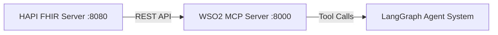

# FHIR MCP Server (WSO2)

This directory contains instructions for running the **WSO2 FHIR-MCP server** and connecting it to our local HAPI FHIR server.

The MCP layer exposes FHIR interactions (search, read, update, delete, etc.) as structured tools that can be called by our LangGraph agent system.

## Official Reference

This implementation uses the official WSO2 FHIR-MCP server:

https://github.com/wso2/fhir-mcp-server

Please refer to the official repository for:
- Advanced configuration options
- Environment variable documentation
- Authorization updates
- Production deployment guidance

This README documents the configuration used specifically for our Capstone-ED development environment.
## Architecture Overview



## Prerequisites

Before starting MCP:

1. Docker Desktop is running
2. HAPI FHIR container is running on port `8080`
3. FHIR dataset has been loaded into HAPI

Verify HAPI:

```bash
curl http://localhost:8080/fhir/metadata
```
If you see a CapabilityStatement JSON response, HAPI is working. See fhir_server/README.md for HAPI setup instructions.

## Install MCP image
Pull the official WSO2 image
```bash
docker pull wso2/fhir-mcp-server:latest
```
## Create a .env file inside this directory.

```bash
touch .env
```
add this
```
FHIR_SERVER_BASE_URL=http://host.docker.internal:8080/fhir
FHIR_SERVER_DISABLE_AUTHORIZATION=True
```
## Run MCP server

```bash
docker run --env-file .env -p 8000:8000 wso2/fhir-mcp-server:latest
```
If successful, you should see:
```
Uvicorn running on http://0.0.0.0:8000
```
