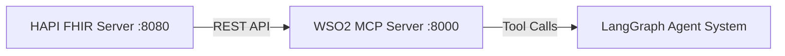

# FHIR MCP Server (WSO2)

This directory contains instructions for running the **WSO2 FHIR-MCP server** and connecting it to our local HAPI FHIR server. 

The MCP layer exposes FHIR interactions (search, read, update, delete, etc.) as structured tools that can be called by our LangGraph agent system.

## Important: File Pathing Requirement
To prevent environment-specific pathing errors during execution, ensure that the main execution script (`run_er_snapshot.py`) is located in the **project root directory** rather than within this or other sub-folders.

## Official Reference

This implementation uses the official WSO2 FHIR-MCP server:

https://github.com/wso2/fhir-mcp-server

Please refer to the official repository for:
- Advanced configuration options
- Environment variable documentation
- Authorization updates
- Production deployment guidance

This README documents the configuration used specifically for our Capstone-ED development environment.

## Architecture Overview



## Prerequisites

Before starting MCP, ensure:
* Docker Desktop is running.
* HAPI FHIR container is running on port 8080.
* The FHIR dataset has been successfully loaded into HAPI.

**Verify HAPI:**
Use the following command to verify the server status:

```bash
curl http://localhost:8080/fhir/metadata
```
**Security Note:** If you encounter security popups, "Permission Denied," or "Insecure Connection" errors when running curl, ensure your terminal has the necessary administrative permissions. On some systems, you may need to bypass proxy settings or explicitly allow the connection in your firewall/antivirus software.

If you see a CapabilityStatement JSON response, HAPI is working correctly. See fhir_server/README.md for detailed HAPI setup instructions.

## Installation and Execution
**Pull the MCP Server**
Consolidated command to pull the official WSO2 image:

```bash
docker pull wso2/fhir-mcp-server:latest
```

## Environment Configuration (.env)
Create a .env file inside this directory to store configuration variables.
* Windows (PowerShell): new-item .env
* macOS/Linux: touch .env

Add the following lines into the .env file and save:
```
FHIR_SERVER_BASE_URL=http://host.docker.internal:8080/fhir
FHIR_SERVER_DISABLE_AUTHORIZATION=True
```
## Run MCP server

```bash
docker run --env-file .env -p 8000:8000 wso2/fhir-mcp-server:latest
```
If successful, you should see:
```
Uvicorn running on http://0.0.0.0:8000
```
**Note:** Once running the MCP server and seeing Uvicorn as having been run, the terminal will continue running for a long time. At this point you should open a new terminal to continue.
